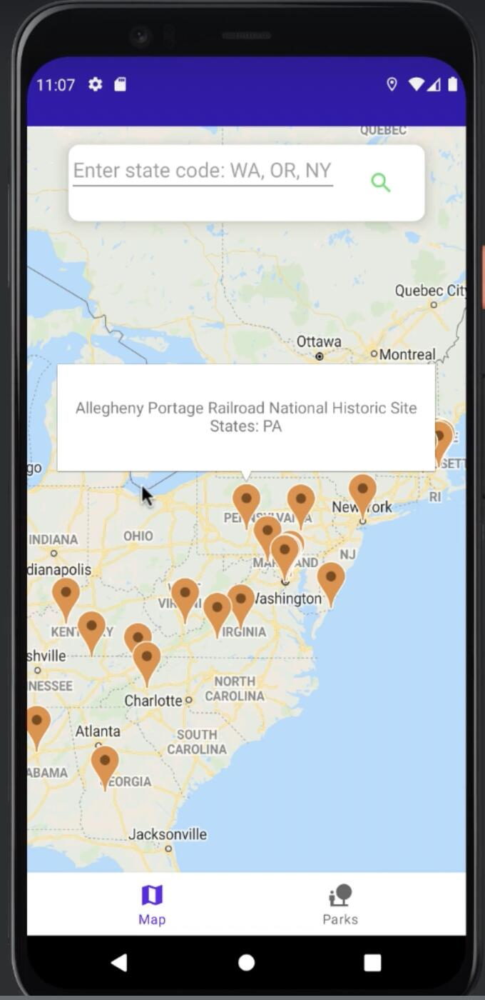
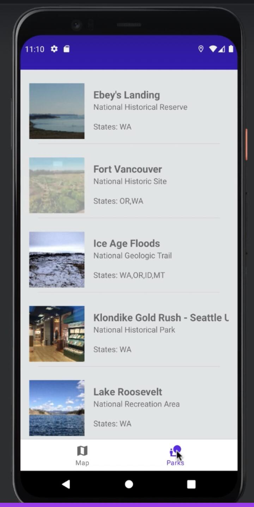
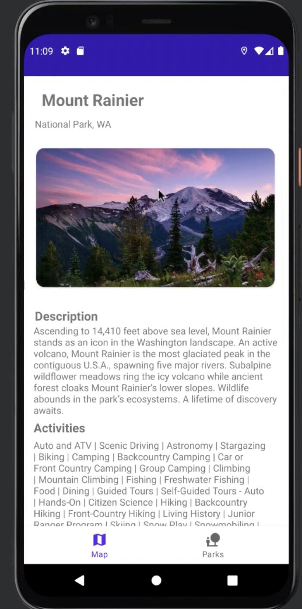

<div align="center">

# WeatherFinder - Android Mobile app

An Android app to search weather by city name and display maps and real‑time weather info (city, country, description, temperature).

</div>

## Features

- Search cities using the OpenWeather API
- Display multiple matches as a list: city, country, description, temperature
- Temperature unit conversion (°C / °F) with optional trailing zeros
- Material + Card UI; light/dark theme support

## Tech Stack

- Language: Java
- minSdk 26 / targetSdk 33
- Gradle 7.4, Android Gradle Plugin 7.3.1
- UI: AppCompat, Material Components, ConstraintLayout, RecyclerView, CardView
- Networking: `HttpURLConnection` on a background thread (`HandlerThread` / `Handler`)

## Project Structure

```
app/
├─ src/main/
│  ├─ java/edu/northeastern/weatherfinder/
│  │  ├─ MainActivity.java                  // Entry screen, navigates to search
│  │  ├─ WeatherSearchActivity.java         // City search, HTTP request, JSON parsing
│  │  ├─ CityWeatherListFragment.java       // Fragment showing the result list
│  │  ├─ CityWeatherListAdapter.java        // RecyclerView adapter
│  │  └─ Weather.java                       // Weather data model
│  ├─ res/layout/
│  │  ├─ activity_main.xml                  // Home layout
│  │  ├─ activity_weather_search.xml        // Search screen layout
│  │  ├─ fragment_city_weather_list.xml     // Result list layout
│  │  └─ city_weather_item.xml              // Row item layout
│  ├─ res/values/strings.xml                // Strings and API key placeholder
│  └─ AndroidManifest.xml                   // Permissions & activities
└─ build.gradle                             // Module configuration
```

## Requirements

- Android Studio (Hedgehog or newer recommended)
- JDK 11 (compatible with AGP 7.3.1)
- Android SDK 33

## Getting Started

1) Clone the repo and open it in Android Studio

2) Configure your OpenWeather API key (required)

- Option A (quick start): set your key in `app/src/main/res/values/strings.xml` for `apiKey`.
- Option B (recommended): inject the key at build time via `gradle.properties`/`local.properties` and read it from `BuildConfig` or manifest placeholders. The current project uses the string resource approach; feel free to switch as an improvement.

OpenWeather: https://openweathermap.org/api

3) Connect a device or start an emulator, then build and run

- Android Studio: Run ▶
- CLI:

```
./gradlew assembleDebug
```

The APK will be in `app/build/outputs/apk/debug/`.

## Permissions

- `INTERNET`, `ACCESS_NETWORK_STATE` for network access (see `app/src/main/AndroidManifest.xml`).

## How It Works

- MainActivity navigates to the search screen
- WeatherSearchActivity:
  - Reads the city input and performs a background HTTP request
  - Builds the OpenWeather URL with locale (`lang`) and API key
  - Parses the JSON response and extracts the city list
  - Shows the results in `CityWeatherListFragment`
- CityWeatherListFragment converts JSON to a list of `Weather` objects and binds a RecyclerView
- CityWeatherListAdapter renders city, description, temperature with unit formatting
- UnitConvertor provides temperature/rainfall conversions

## API and Localization

- Endpoint: `https://api.openweathermap.org/data/2.5/find?q={city}&lang={locale}&mode=json&appid={API_KEY}`
- Language: uses the device language for the `lang` parameter (`Locale.getDefault().getLanguage()`)

## Screenshots
| Home Map | Card View | Detailed Info |
|:----------------------:|:---------------:|:---------------:|
|  |  | |

## Roadmap / Ideas

- Replace `HttpURLConnection` with OkHttp/Retrofit and a cleaner async model
- Inject the API key at build time to avoid storing it in `strings.xml`
- Better error/empty/offline/loading states and retry
- Favorites/recent searches, pull‑to‑refresh
- Unit and UI tests for parsing and conversions

## License

- license (MIT/Apache‑2.0, etc.).

